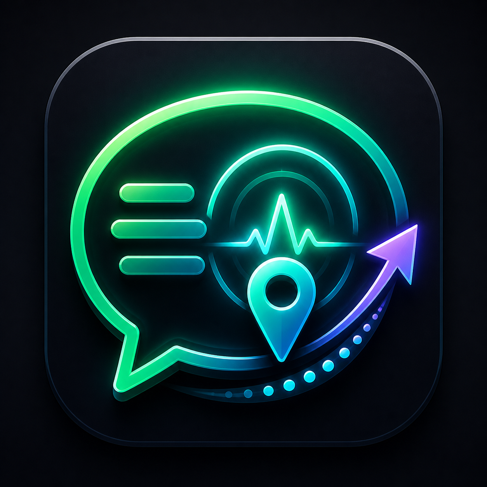

# ChatGPT Message Navigator

一个给 ChatGPT 页面用的小型 Chrome 扩展：右下角显示一个头像按钮，点开后会列出当前对话里你发出的消息预览，点击任意一条就能滚动回对应位置。

中文名：ChatGPT 消息导航器。长对话里不用反复上下滑，点一下就能回到你发过的消息。

## 安装

1. 下载或 clone 这个仓库。
2. 打开 Chrome，进入 `chrome://extensions/`。
3. 打开右上角的“开发者模式”。
4. 点击“加载已解压的扩展程序”。
5. 选择这个项目文件夹。
6. 刷新 ChatGPT 页面。

## 本地开发安装

1. 打开 Chrome，进入 `chrome://extensions/`。
2. 打开右上角的“开发者模式”。
3. 点击“加载已解压的扩展程序”。
4. 选择本地项目文件夹。
5. 刷新 ChatGPT 页面。

## 使用

- 打开 `https://chatgpt.com/` 或 `https://chat.openai.com/` 的任意对话。
- 点击页面右下角的头像按钮。
- 面板里会显示你发出的消息片段；纯图片或附件消息会显示为“图片消息”或“附件”。
- 点击某条消息，页面会平滑滚动到那条消息的位置。
- 长对话里，ChatGPT 可能只渲染当前附近的消息；插件会在你上下滚动时持续收集新出现过的历史消息。

## 文件

- `manifest.json`: Chrome 扩展配置。
- `content.js`: 扫描用户消息、渲染浮动面板、处理跳转。
- `styles.css`: 浮动按钮和消息面板样式。
- `icons/`: ChatGPT Message Navigator 的扩展 Logo 和 Chrome 图标尺寸。
- `assets/kunkun.jpg`: 页面右下角悬浮按钮头像。
